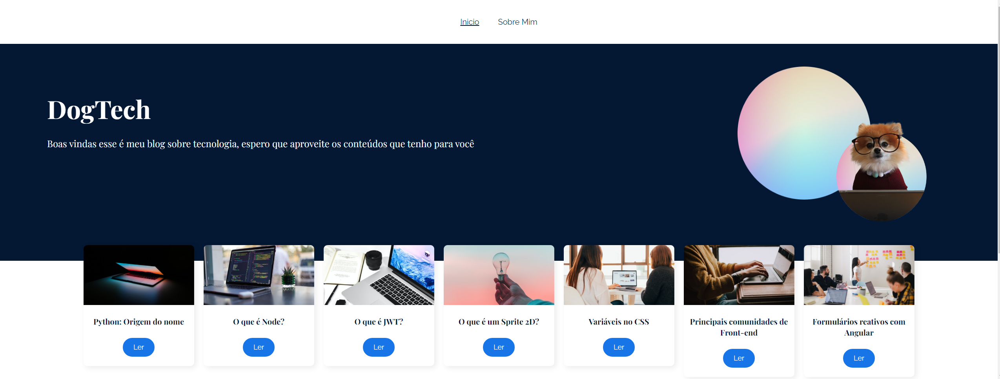

#DogTech

Este é o repositório de uma aplicação React, que utiliza React Router Dom, é um blog de tecnologia, que contém duas rotas principais.

## Funcionalidades

- Barra de navegação para navegar entre as rotas do projeto.
- Banner padrão em todas páginas que forem abertas.
- Cards dos artigos na página inicial que levam a uma nova página pra leitura de cada um.
- Página sobre mim, onde falo um pouco sobre quem sou.

## Tecnologias Utilizadas

  
 
 
 